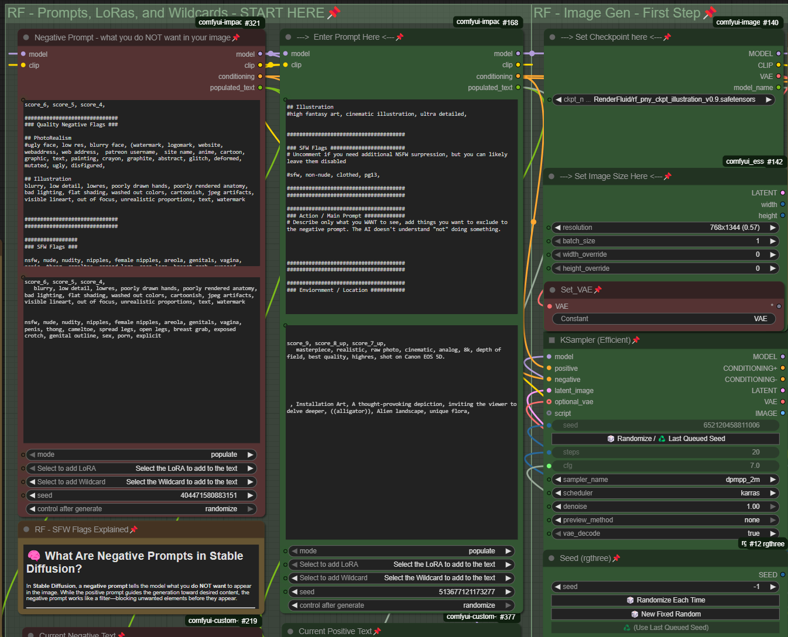
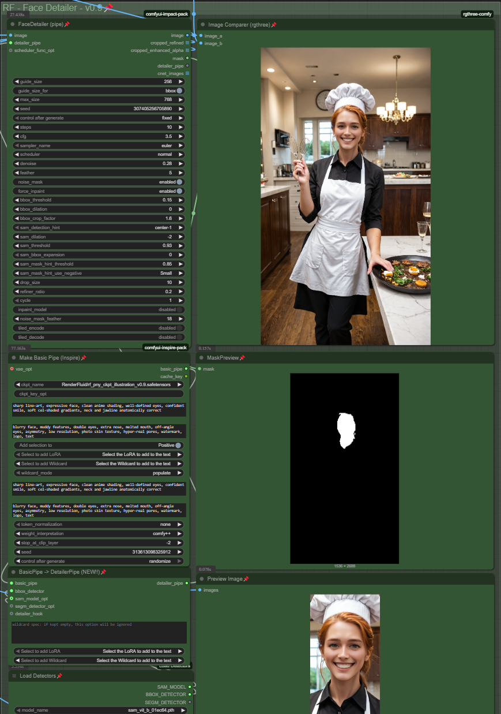
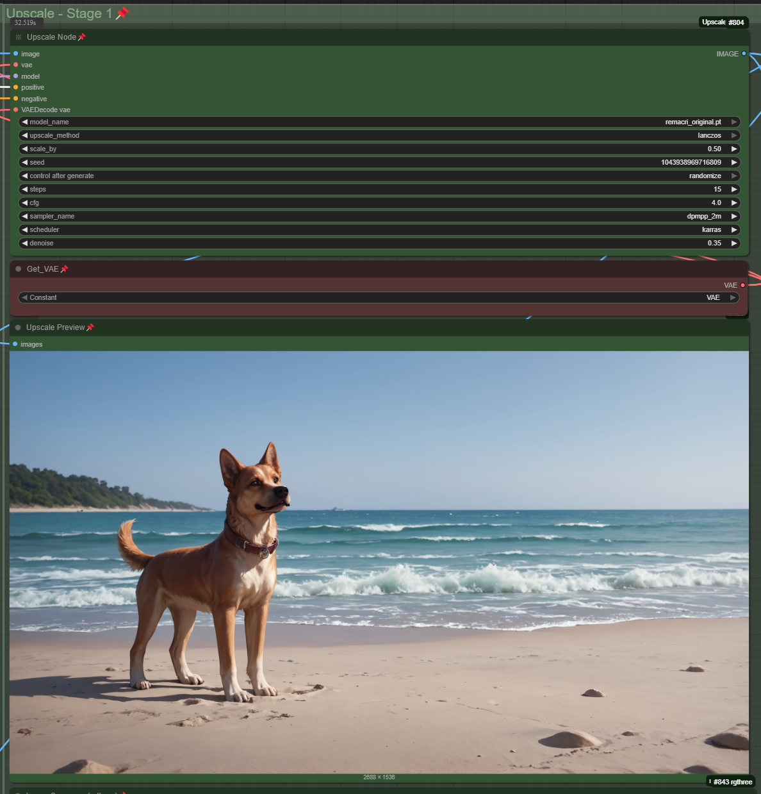
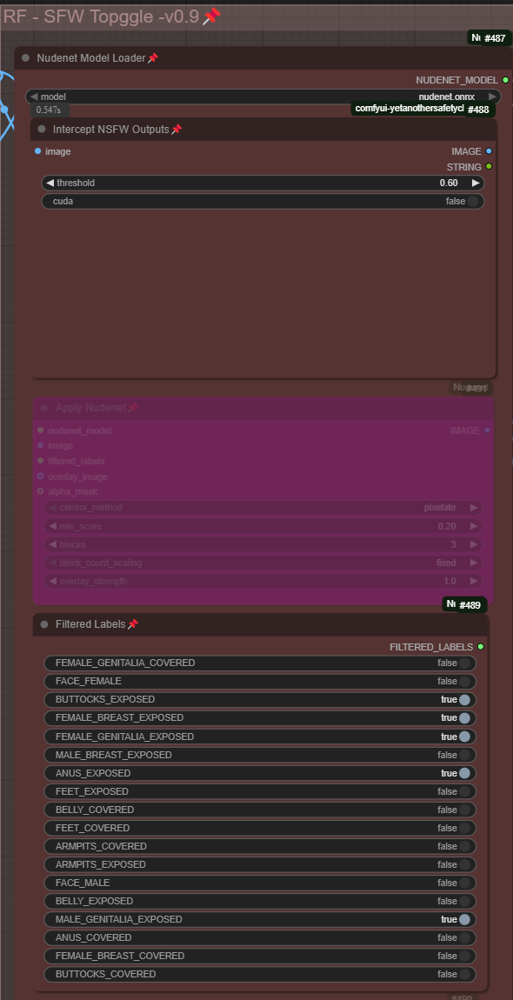
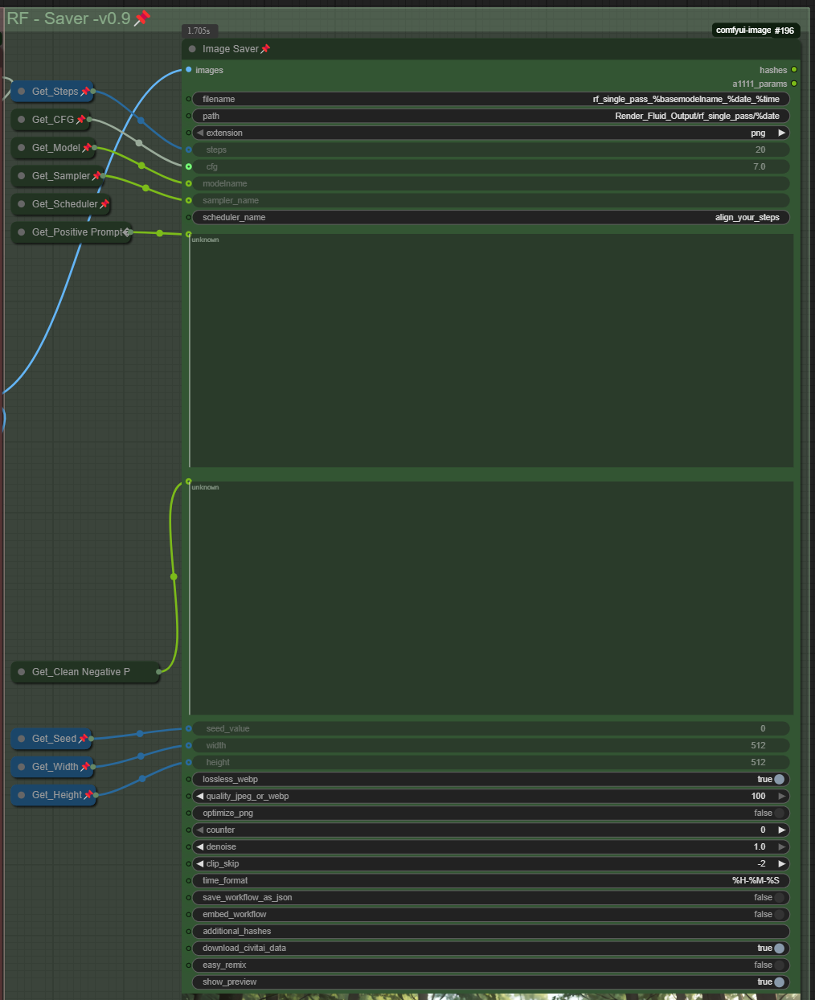
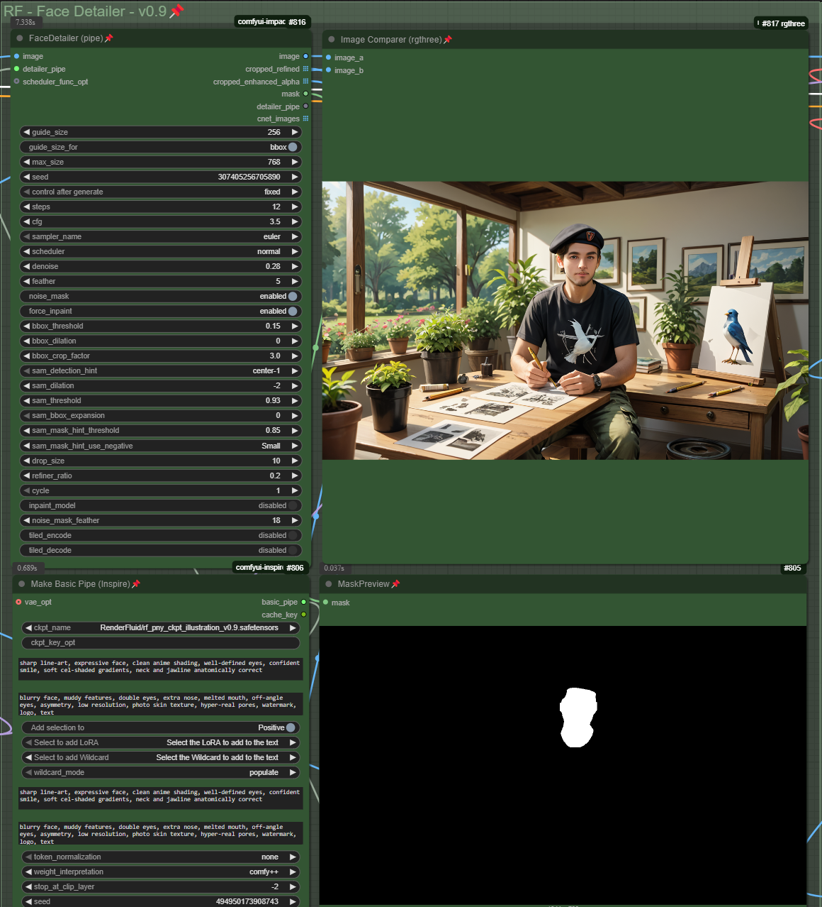
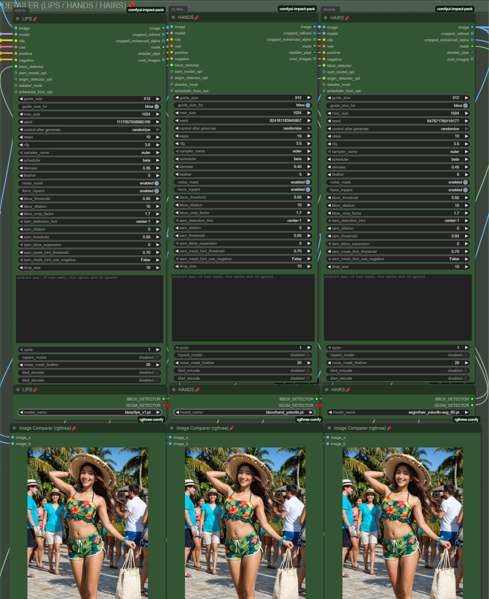
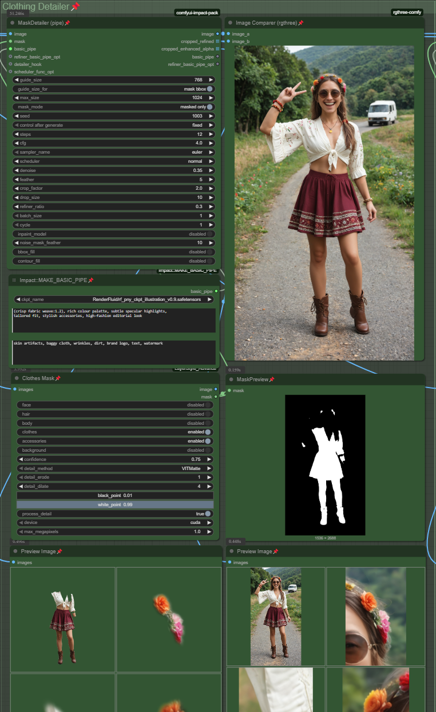
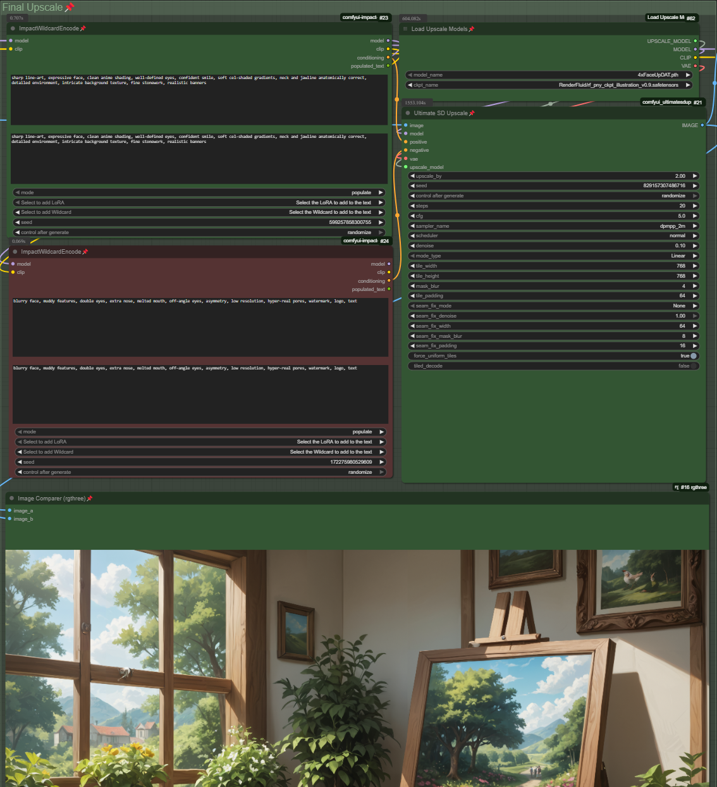

# 🎨 RenderFluid Illustration Pipeline – Quick Start Guide

The RenderFluid Illustration Pipeline is designed for fast, safe, and stylized AI image generation using the **PNY checkpoint**, a refined, SFW-only model based on RealCartoon-Pony. This workflow gives you plug-and-play control with built-in prompt templates, automatic safety filters, and a face detail pass—all with zero setup required.

If you’re looking to generate character art, concept pieces, or expressive stylized visuals that are appropriate for work and public use, this is the best place to start.

---


---

## ✅ Step 1: Launch the Workflow

In ComfyUI, go to the top menu and open:

```
Browse Templates → RenderFluid → Illustration → Stage One - PNY, Single Image _v2.0
```

This will load the full base pipeline for single-image generation with the PNY model. It’s already wired with the correct safety nodes, prompt sections, LoRA support, and face detail enhancements. No setup is needed—just plug in your prompt and hit **Queue Prompt** to generate.

## 🖼️ Stage One – Generate Your First Image

The Stage One pipeline is already preloaded with a working prompt, safety layers, and a default model. To get started quickly: **just hit Run**.

This will generate your first image using the RenderFluid PNY illustration checkpoint and a full wildcard-based prompt. Once you confirm everything is working, you can start customizing:



---

### 🔧 Step-by-Step Customization

1. **Prompt & Wildcards**  
   In the **Enter Prompt Here** node, you’ll see a complete prompt using wildcards. You can edit this directly or use the dropdown menus to insert new wildcard groups. These expand into randomized but curated terms to help vary your outputs or inspire new styles.

2. **Set Your Resolution**  
   In the **Set Image Size Here** section, choose from predefined resolution options. Each size is labeled with its aspect ratio (e.g., 16:9, 4:3). Use tall sizes like `768x1344` for portraits or wider sizes like `1280x720` for thumbnails or backgrounds.

3. **Checkpoints**  
   By default, the model is set to the RenderFluid PNY checkpoint. You can switch this in the **Set Checkpoint Here** node if you're working with a different model.

4. **LoRAs**  
   To add a LoRA, use the dropdown under **Select LoRA to add to the text**. LoRAs adjust the style or content of your generation and are automatically added to the prompt with the correct weight format. You can include more than one and adjust strength values to fine-tune the results.

---
## 🖌️ Step 2 – Initial Image Generation

Once your prompt and resolution are set, it's time to generate your first image. The **KSampler** node is what actually runs the AI model and turns your prompt into a final image.

You’ll see options like `steps`, `cfg`, `sampler_name`, and `scheduler`. These control the quality, randomness, and variation in your output. For most users, **there’s no need to adjust these**—you’ll get better results by experimenting with different **checkpoints** or **LoRAs** before touching sampler settings.


If you want to tweak later:
- Increase **steps** (e.g. 20+) for more detail
- Adjust **cfg** (5–7.5 range is ideal) to control how strongly the model follows your prompt
- Change **sampler** types if you’re chasing a specific look

But for now, just run the image with default settings and review the results!

## ✨ Step 3 – Initial Face Detailer Pass

After the image is generated, RenderFluid runs a lightweight **Face Detailer** step. This module detects any visible faces and enhances them with extra detail, helping sharpen expressions and facial structure in illustration-style models.



Illustration checkpoints often lack strong facial fidelity—so this step is important to ensure better results during the final upscale stages. That said, this **is not the final detailing pass**. It's optimized to inject just enough structure early on, without overprocessing or altering the artistic feel.

**Recommended:** Leave the settings as-is, or disable the node entirely if you're generating non-human subjects. You don’t need to make changes here unless you’re doing deep experimentation. The full detail enhancement happens later in the pipeline.

## 🔍 Step 4 – Initial Upscale Pass

Once the face detailing is complete, the image enters **Upscale – Stage 1**, where it is resized and cleaned up using an efficient upscaler (by default, `remacri_original.pt`). This step prepares the image for final output or further enhancement, depending on your needs.



This stage uses **Lanczos** as the upscaling method and increases the image size by a factor of 1.5x. That’s often enough for **social media, concept art, or general use**. If you’re happy with the result, you can stop here and export the image. But if you want **maximum fidelity for print or high-resolution use**, this upscale provides a better base for later face and background detailers to work from.

### Key Settings:
- **upscale_method**: Controls the algorithm; Lanczos is fast and crisp.
- **scale_by**: Determines how much to increase the image size (1.5x default).
- **steps / cfg / denoise**: These affect quality and can be tuned, but the defaults are optimized for balance and speed.


## 🛡️ Step 5 – SFW Enforcement (Topggle Filter)

RenderFluid includes an integrated SFW enforcement layer powered by **NudeNet**, which automatically scans and flags NSFW content before it finishes rendering. This is designed for creators working in regulated or public-facing environments where safe outputs are critical.



### How It Works:
The **Intercept NSFW Outputs** node uses the loaded `nudenet.onnx` model to evaluate each image. If any flagged content exceeds the **threshold** (default is `0.60`), the graph will be stopped before the image is finalized—ensuring nothing unsafe slips through.

- You can adjust the **threshold** to change sensitivity. A lower number catches more content, but may cause false positives.
- The current setup **kills the graph** for flagged content. This is the strictest and safest mode.

### Optional: Use Nudity Blur Instead of Kill
If you prefer to **blur** the flagged content instead of stopping the render, you can enable the **Apply NudeNet** node (currently disabled) and disable the Intercept node. This applies a **pixelation filter** to any flagged body parts using your selected filter list.

⚙️ You can modify what counts as NSFW in the **Filtered Labels** section. For example, if you want to allow bare feet but still block nudity, just toggle those options.

📌 Full instructions and explanations are included inside the workflow canvas—hover over each section for help tips.

## 💾 Step 6 – Save the Image (with Metadata)

The final step in Stage One is handled by the **RF - Saver** module. This node saves your generated image to disk, embedding full metadata (seed, resolution, model, LoRA, prompt, and more) in the PNG file—making it easy to re-use or remix later.



### Key Features:

- 📁 **Output Path:** Files are saved to `Render_Fluid_Output/rf_single_pass/` by default.
- 🧠 **Auto Naming:** Filenames include the model name, date, and time stamp for easy version tracking.
- 🧬 **Metadata Embedded:** You’ll retain all workflow details inside the image file—including the positive/negative prompts, model details, and config used.
- 🎨 **Seed and Size Recorded:** Ensures exact reproducibility if you want to regenerate the same image later.

This metadata is compatible with tools like CivitAI’s remix features and other ComfyUI pipelines that load from PNG files.


## 😶 Stage 1.5 – Expression Control & Face Swapping (Optional)

RenderFluid includes a separate optional pipeline for **expression editing and face swapping**, which can be used after Stage One if you're looking to replace character faces or refine emotional tone.

This pipeline is fully documented in the **Expression + Swap** guide, and supports batch and single image use with powerful expression editing tools.

> ⚠️ **Important:** If you're running the face swap workflow on illustration-style outputs, we **recommend disabling the FaceDetailer** in that workflow. It's optimized for photo realism and may over-sharpen stylized faces.

Use Stage 1.5 only when you need identity control or expressive precision—otherwise, proceed directly to Stage Two.

## 🎯 Stage 2 – Character Detail Enhancement

After generating your base image in Stage One, you now have the option to refine it further using **Stage Two: the Detail Pipeline**. This step adds fine-grain improvements to character visuals, enhancing facial structure, clothing edges, and overall texture clarity—especially useful before high-resolution upscaling.

You have two versions to choose from:

### 1. Full (Heavy) Detail Pipeline
Includes detailers for:
- Face
- Eyes
- Lips
- Hands
- Hair
- Clothing
- Skin
- Background

This version is ideal if you're working on **character-focused images** where expressions, styling, and subtle details matter. All modules are optimized for illustration use and tuned for visual consistency.

### 2. Lite Detail Pipeline
Includes only the most impactful modules:
- Face
- Eyes
- Clothing
- Background

This version runs faster and uses less VRAM, making it a better choice for quick iterations or when rendering in bulk. For most illustration use cases, the Lite version delivers nearly the same visual impact.

---

For this guide, we’ll continue with the **Full (Heavy) Detail Pipeline**.


## 🧪 Stage 2: Face Detailer

The **Face Detailer** is the first node in the Stage 2 refinement pipeline. It performs a precision pass on the face using high-resolution crops, stylized prompt injection, and local mask blending. It’s optimized for illustration-style character rendering and provides sharp, expressive facial improvements.



### ✅ How It Works

- Detects the face using SAM or bounding box hints  
- Crops the face using `sam_crop_factor`  
- Generates a new face from a face-specific prompt  
- Blends the face back into the original using a mask  
- Outputs a refined image and face mask  

### 🔧 Key Settings

- `guide_size`: resolution for face crop (usually 1024)  
- `guide_size_for`: method used for guiding crop (`bbox` or `mask`)  
- `max_size`: cap for the generated face resolution  
- `scheduler_func_opt`: crop/blend method (`cropped_enhanced_alpha` recommended)  
- `control after generate`: enable ControlNet post-generation (optional)  
- `sample`: number of face generations (default: 1)  
- `clip_skip`: skip CLIP layers to alter style  
- `sam_dilation`: expands mask edge (3–5 recommended)  
- `sam_threshold`: mask tightness (lower = tighter)  
- `sam_mask_hit_use_negative`: adds negative prompt influence  
- `refine_ratio`: how much of the new face replaces the original  
- `inpaint_model`: optional blending via inpaint (usually off)  
- `sam_detection_hint`: center face detection logic  
- `sam_mask_binarization`: mask sharpness threshold  
- `inpaint_mask_feather`: edge feathering (disable if doing later detail pass)  

### 🧠 Prompt Overrides

This stage supports localized prompt input through the `Make Basic Pipe` node. This allows face-only prompts like:

`sharp line-art, expressive face, clean anime shading, confident smile`

Use this to override flat or mismatched expressions from the base image.

### 🛑 NSFW Blocking

> This node includes built-in NSFW detection and blocking.  
> Users are **forbidden** from bypassing these protections.  
> This complies with the RenderFluid and ReActor license terms.

### 📊 Visual Outputs

- Right panel: before/after face comparison  
- Bottom panel: binary face mask preview  
- Output: merged refined image with face improved  

This is the most impactful stage for character-focused art. You can skip it only if using another face detailer later in the pipeline.

## 👁️ Stage 2: Eye Detailer

The **Eye Detailer** is the second refinement node in Stage 2 of the RenderFluid pipeline. It builds directly on the logic of the Face Detailer but focuses exclusively on enhancing the eye region. This includes sharpening lashes and pupils, refining reflections, correcting eye alignment, and enhancing emotional expression through controlled prompt injection.

You can customize eye color with prompts like:

- `emerald green eyes`
- `amber eyes with dark lashes`
- `icy blue anime-style eyes`
- `red glowing irises, supernatural aura`

## 💋✋💇 Stage 2: Lips / Hands / Hair Detailers

These three detailers—**Lips**, **Hands**, and **Hair**—are grouped into a single stage because they follow the same core logic: crop, mask, enhance, and blend. They each use a version of the same base detailer node, but are tuned with area-specific bounding box detectors, crop settings, and prompts. These refinements offer subtle but meaningful improvements in realism, sharpness, and stylistic consistency—especially for close-up portraits or character renders.



These modules are **optional** for most illustration workflows. Disabling them can speed up batch rendering with little visual loss for distant subjects. However, enabling them provides maximum polish, especially in high-res or close-up images.

---

### ✅ How They Work (Shared Logic)

- Use bounding box detection to locate the relevant region (mouth, hands, or hair)  
- Crop the region using the `sam_crop_factor` and related thresholds  
- Inject a tuned prompt to generate a sharper, more expressive version of the target area  
- Merge the detail crop back into the original image using soft masks  
- Output the merged image and show before/after in the comparison panel  

---

### 🔧 Shared Key Settings (All Detailers)

- `guide_size`: typically 512 (for smaller areas like lips and hands)  
- `max_size`: 1024 is the default for higher resolution crops  
- `sam_crop_factor`: adjusts how tight or loose the crop is  
- `sam_dilation`: expands the mask boundary (2–3 is safe)  
- `sam_mask_hit_threshold`: used to determine whether the region is confidently detected  
- `inpaint_model`: usually disabled unless running a separate inpaint pass  
- `inpaint_mask_feather`: 20px feathering to blend smoothly  
- `clip_skip`: adjust to match the visual style of other refiners  
- `model`: inherits from main render unless overridden  

---

### 💄 Lips Detailer

This node focuses on the mouth and lips region. It sharpens lips, enhances gloss or texture, and can improve smile rendering.

**Prompt Suggestions:**

- `glossy lips, defined lip shape, subtle smile, stylized shading`  
- `smooth lipstick texture, high-contrast mouth definition, semi-gloss`  
- `delicate lips, expressive mouth, subtle lip shine`  

**Bounding Box Model:** `bbox/lips_yolov8`  
Best used for: portrait shots, stylized smiles, or beauty-focused illustrations

---

### ✋ Hands Detailer

Enhances the shape, lighting, and pose of hands. Helps correct hand distortion or missing fingers in some workflows. May be skipped for stylized characters with simplified hands.

**Prompt Suggestions:**

- `well-defined hands, accurate fingers, soft lighting, stylized gesture`  
- `realistic fingers, smooth shading, pose-corrected hands`  
- `elegant hand pose, palm detail, accurate thumb placement`  

**Bounding Box Model:** `bbox/hand_yolov8`  
Best used for: natural gestures, item holding, or visible full-body characters

---

### 💇 Hair Detailer

Focuses on sharpening strands, highlights, and hair flow. Useful for long hairstyles or characters with detailed curls, waves, or braids.

**Prompt Suggestions:**

- `flowing hair, defined strands, glossy highlights, natural volume`  
- `shiny curls, layered bangs, wind-blown hair detail`  
- `sharp hair definition, anime-style hair shine, soft waves`  

**Bounding Box Model:** `seg/hair_yolov8-seg-B1`  
Best used for: portraits, wind effects, or backlit hair glow

---

### 📊 Visual Outputs

Each detailer includes a connected `Image Comparer` panel to preview the before/after result. These refiners only update their target area, allowing you to isolate improvements in that specific zone without changing the rest of the image.

---

These detailers give you precision control over high-detail regions that often break down in lower-resolution workflows. Use them all for maximum refinement, or toggle off any that aren’t needed for your current style.

## 👗🧴🌄 Stage 2: Clothing / Skin / Background Detailers

The **Clothing**, **Skin**, and **Background Detailers** represent the final surface-level refiners in the RenderFluid illustration pipeline. These nodes use the same `MaskDetailer` architecture as earlier stages but apply it to broader regions of the image using class-specific masks (e.g. “clothes,” “skin,” or “background”). This allows for localized enhancement of color, texture, fabric folds, lighting, or environment — all without altering the character's core shape or structure.



Each node follows the same crop–mask–refine–blend structure but uses **different prompts**, **mask targets**, and **detail tuning** to achieve the best results for its focus area.

---

### ✅ How They Work

- A target mask (clothes, skin, or background) is generated using a segmentation model like `VITMatte`  
- A custom prompt guides detail regeneration for the masked region  
- A crop is created and passed to the base model with tuning settings  
- The output is reblended into the original using soft boundaries  
- Final result is passed downstream with enhanced detail  

---

### 🔧 Shared Key Settings

These are common across all three nodes:

- `guide_size`: usually 768 for mid-size regions  
- `max_size`: 1024 default for full-body coverage  
- `mask_mode`: set to `masked only` to isolate the region  
- `crop_factor`: 2.0–2.3 for safe cropping without bleed  
- `refiner_ratio`: 0.8–1.0 for maximum clarity  
- `noise_mask_feather`: 10px recommended for soft blend  
- `contour_fill`: leave disabled unless edge artifacts appear  
- `cfg` and `denoise`: adjust for stylistic vs photoreal render control  
- `basic_pipe`: used to inject prompt guidance per region  

---

### 👗 Clothing Detailer

Enhances textiles, patterns, accessories, and folds in fabric. Useful for fashion images, stylized costumes, or when accessories need to pop.

**Prompt Example:**

`crisp fabric weave(1.2), rich colour palette, subtle specular highlights, tailored fit, stylish accessories, high-fashion editorial look`

Recommended for: cosplay renders, streetwear fashion, high-res fantasy gear

---

### 🧴 Skin Detailer

(OPTIONAL for illustration styles)

Used to smooth or refine skin tones, highlight curvature, or reduce shading artifacts. In illustration work, this step is often unnecessary unless very close-up or realism-adjacent.

**Prompt Example:**

`smooth glowing skin, soft ambient shadows, peach undertones, stylized painterly texture, clear highlights`

Use only if skin is a primary focal area or if original image has texture issues.

---

### 🌄 Background Detailer

Refines trees, skies, streets, walls, or any scene setting in the environment. It enhances clarity without redrawing or shifting perspective.

**Prompt Example:**

`lush landscape, deep sky gradient, sunlit grass, high-contrast shadows, soft clouds, photoreal scenic depth`

Ideal for scenic compositions or when environmental storytelling is important.

---

### 📊 Visual Outputs

- MaskPreview: shows the selected target region (clothes, skin, or background)  
- Preview Image:

## 🧱 Stage 3: Final Upscaler (Super Resolution)

The **Final Upscaler** is the last stage of the RenderFluid pipeline. It applies a powerful high-resolution pass using a tile-aware super-resolution model, enabling zoom-level detail and ultra-sharp renders for large formats. This step is **computationally intensive** and adds significant processing time, so it’s only recommended when:

- You plan to **crop or zoom** into the final image  
- You need **gallery-quality output** or large format prints  
- You are rendering for **commercial** or **detail-critical** uses  



For most web-based or general illustration workflows, this step can be safely skipped.

---

### ✅ How It Works

1. The image is passed through a tile-aware upscaling model (such as `4xUltrasharp`)  
2. A high-quality prompt is re-applied for diffusion-based refinement  
3. LoRA and wildcard modifiers can be added one final time  
4. The image is split into tiles, upscaled, and then merged seamlessly  
5. The final output is merged back into the graph for preview or save  

---

### 🔧 Key Settings (Ultimate SD Upscale)

- `upscale_model`: the upscaling checkpoint (e.g. `RenderFluidF_pny_clip8_illustration_v0.9_safefusion`)  
- `scale`: how much to upscale — **2.0** is standard  
- `cfg`: classifier-free guidance scale — **7.0–9.0** is a good range  
- `steps`: sampling steps — higher = more accurate, slower (20–40 recommended)  
- `sampler_name`: sampler used — `dpmpp_2m_sde` is high quality  
- `tile_width` / `tile_height`: size of each tile (e.g. `512x512`)  
- `tile_pad`: padding between tiles to avoid seams (16–32 works well)  
- `tile_overlap`: optional overlap between tiles  
- `tiled_decode`: leave disabled unless using specific custom decoders  
- `seam_fix_denoise`: fixes tile seam inconsistencies (1.0 = strong fix)  
- `seam_fix_mask_blur`: blurs mask edge between tiles (8–16 is typical)  
- `seam_fix_padding`: blends padding area between tiles  

---

### 🎨 Prompt Refinement

This node reuses or extends the existing prompt with additional detail emphasis. You can optionally:

- Re-inject wildcard-enhanced prompts  
- Re-apply LoRA or stylistic changes  
- Use final touch phrasing like:  
  - `ultra-fine detail, crisp contrast, edge-defined clarity, print-ready resolution`  
  - `4K gallery finish, noise-free texture, surface realism, clean contour`  

This is also a good place to neutralize noise or restore character sharpness after multiple prior detail passes.

---

### 🖼️ Output

- Final image size depends on scale factor (e.g. 2x of 1024 = 2048)  
- Preview image in the `Image Comparer` shows final output  
- Output can now be saved, converted, or passed to a format/export pipeline  

---

The Final Upscaler is the **most resource-heavy** node in the entire RenderFluid pipeline. Only enable it when your image truly requires that extra level of fidelity — for most use cases, the detailer pipeline alone is sufficient.
