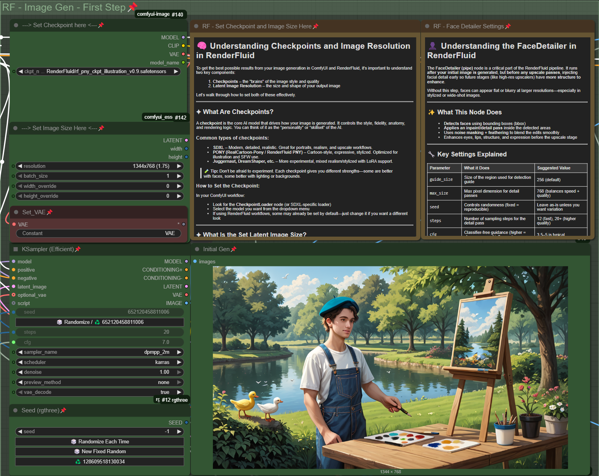

# 🎨 RenderFluid Illustration Pipeline – Quick Start Guide

The RenderFluid Illustration Pipeline is designed for fast, safe, and stylized AI image generation using the **PNY checkpoint**, a refined, SFW-only model based on RealCartoon-Pony. This workflow gives you plug-and-play control with built-in prompt templates, automatic safety filters, and a face detail pass—all with zero setup required.

If you’re looking to generate character art, concept pieces, or expressive stylized visuals that are appropriate for work and public use, this is the best place to start.

---


---

## ✅ Step 1: Launch the Workflow

In ComfyUI, go to the top menu and open:

```
Browse Templates → RenderFluid → Illustration → Stage One - PNY, Single Image _v2.0
```

This will load the full base pipeline for single-image generation with the PNY model. It’s already wired with the correct safety nodes, prompt sections, LoRA support, and face detail enhancements. No setup is needed—just plug in your prompt and hit **Queue Prompt** to generate.

## 🖼️ Stage One – Generate Your First Image

The Stage One pipeline is already preloaded with a working prompt, safety layers, and a default model. To get started quickly: **just hit Run**.

This will generate your first image using the RenderFluid PNY illustration checkpoint and a full wildcard-based prompt. Once you confirm everything is working, you can start customizing:


---

### 🔧 Step-by-Step Customization

1. **Prompt & Wildcards**  
   In the **Enter Prompt Here** node, you’ll see a complete prompt using wildcards. You can edit this directly or use the dropdown menus to insert new wildcard groups. These expand into randomized but curated terms to help vary your outputs or inspire new styles.

2. **Set Your Resolution**  
   In the **Set Image Size Here** section, choose from predefined resolution options. Each size is labeled with its aspect ratio (e.g., 16:9, 4:3). Use tall sizes like `768x1344` for portraits or wider sizes like `1280x720` for thumbnails or backgrounds.

3. **Checkpoints**  
   By default, the model is set to the RenderFluid PNY checkpoint. You can switch this in the **Set Checkpoint Here** node if you're working with a different model.

4. **LoRAs**  
   To add a LoRA, use the dropdown under **Select LoRA to add to the text**. LoRAs adjust the style or content of your generation and are automatically added to the prompt with the correct weight format. You can include more than one and adjust strength values to fine-tune the results.

---
## 🖌️ Step 2 – Initial Image Generation

Once your prompt and resolution are set, it's time to generate your first image. The **KSampler** node is what actually runs the AI model and turns your prompt into a final image.

You’ll see options like `steps`, `cfg`, `sampler_name`, and `scheduler`. These control the quality, randomness, and variation in your output. For most users, **there’s no need to adjust these**—you’ll get better results by experimenting with different **checkpoints** or **LoRAs** before touching sampler settings.



If you want to tweak later:
- Increase **steps** (e.g. 20+) for more detail
- Adjust **cfg** (5–7.5 range is ideal) to control how strongly the model follows your prompt
- Change **sampler** types if you’re chasing a specific look

But for now, just run the image with default settings and review the results!


